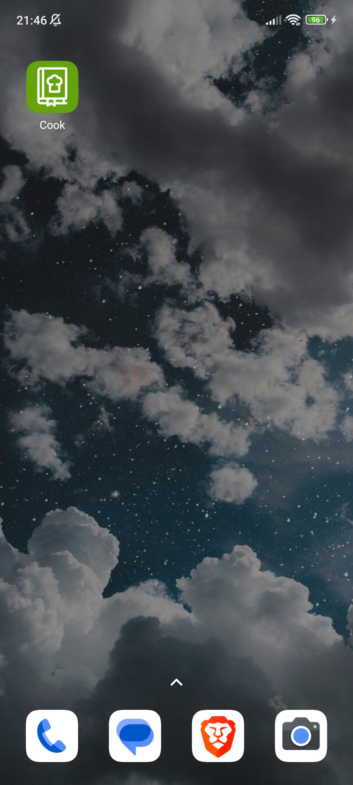
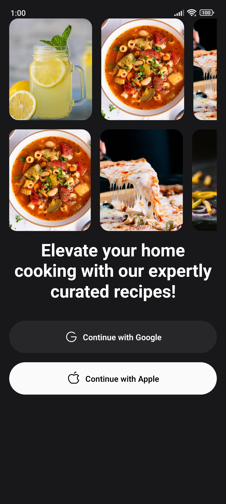
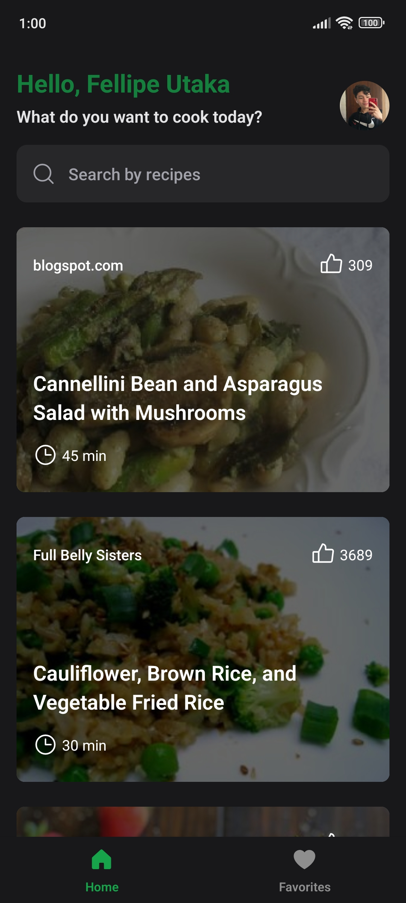
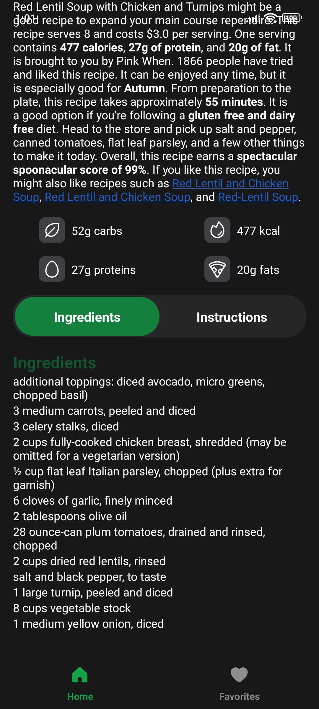
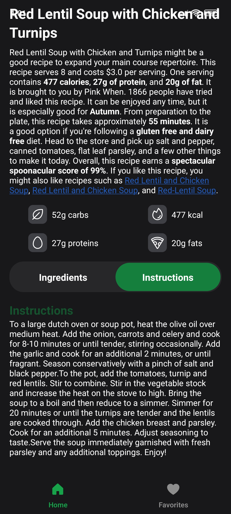
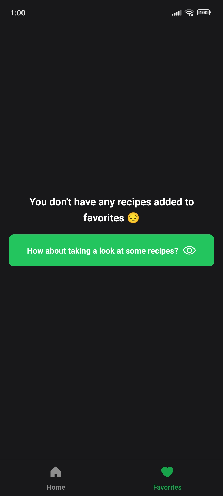
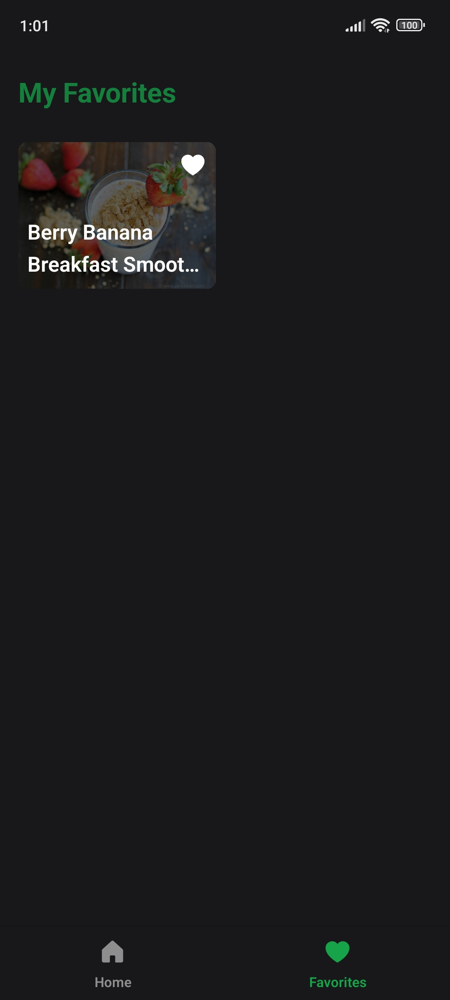

<h1 align="center">
  
</h1>

<h1 align="center">Cook</h4>
<p align="center">
  
  <a href="https://www.linkedin.com/in/fellipeutaka/">
    
  </a>
  <a href="https://github.com/fellipeutaka/cook/commits/main">
    
  </a>
  
  <a href="https://github.com/fellipeutaka/cook/stargazers">
    
  </a>
</p>

<p align="center">
  <a href="#-project">Project</a> |
  <a href="#-technologies">Technologies</a> |
  <a href="#ℹ%EF%B8%8F-how-to-use">How to use</a> |
  <a href="#-how-to-contribute">How to contribute</a> |
  <a href="#-license">License</a>
</p>

## 💻 Project

An app to help people find new recipes.

<h1 align="center">
  
  
  
  
  
  
  
  
  
</h1>

## 🚀 Technologies

This project was developed with the following technologies:

- [TypeScript][ts]
- [React][react]
- [React Native][rn]
- [Expo][expo]
- [React Query][react-query]
- [React Navigation][react-navigation]
- [Reanimated V2][react-reanimated-v2]
- [Axios][axios]
- [TailwindCSS][tailwindcss]
- [Firebase][firebase]

## ℹ️ How To Use

To clone and run this application, first you need to create a [spoonacular](https://spoonacular.com/food-api) account. After creating your account, you will need to generate an API key. Afterwards, you will need [Git][git], [Node.js][node] and [Expo CLI](https://docs.expo.dev/workflow/expo-cli/) installed on your computer.

From your command line:

```bash
# Clone this repository
$ git clone https://github.com/fellipeutaka/cook.git

# Install dependencies
# If you are using NPM
$ npm install

# If you are using Yarn
$ yarn install

# If you are using PNPM (current package manager)
$ pnpm install
```

After that, copy and paste the .env.example file and rename it to .env.
Then insert your token into the API_KEY variable. Great! Now you just need to start the development server.

```bash
# Start server (Android)
# If you are using NPM
$ npx expo prebuild

# If you are using PNPM (current package manager)
$ pnpx expo prebuild

$ expo run:android
```

## 🤔 How to contribute

1. Fork this repository.
2. Create a branch: `git checkout -b <branch_name> `.
3. Make your changes and commit them: `git commit -m '<commit_message> '`
4. Push to original branch:`git push origin <project_name> / <local>`
5. Create the pull request. Or, see the GitHub documentation on [how to create a pull request][pr].

## 📝 License

This project is under the MIT license. See the [LICENSE](https://github.com/fellipeutaka/cook/blob/main/LICENSE.md) for details.

Made with ♥ by Fellipe Utaka 👋 [Get in touch!](https://www.linkedin.com/in/fellipeutaka/)

[pr]: https://help.github.com/en/github/collaborating-with-issues-and-pull-requests/creating-a-pull-request
[git]: https://git-scm.com
[node]: https://nodejs.org/
[ts]: https://www.typescriptlang.org/
[react]: https://reactjs.org
[rn]: https://reactnative.dev/
[expo]: https://docs.expo.dev/
[react-query]: https://tanstack.com/query/latest
[react-navigation]: https://reactnavigation.org/
[react-reanimated-v2]: https://docs.swmansion.com/react-native-reanimated/
[axios]: https://axios-http.com/
[tailwindcss]: https://tailwindcss.com/
[firebase]: https://firebase.google.com/
